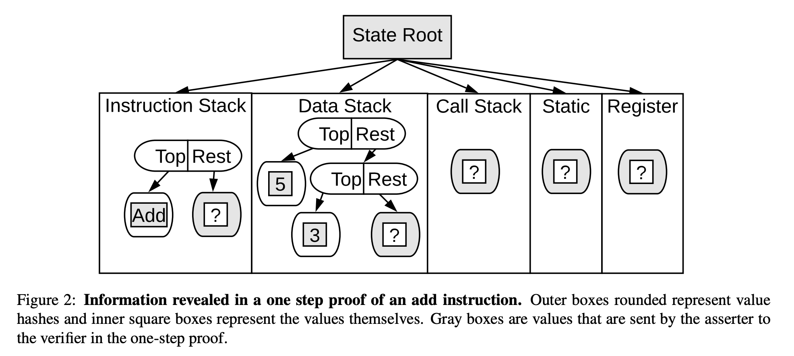

## 欺诈证明

> 在阅读本文之前，建议读者了解 op/arbitrum 中使用的交互式仲裁的技术概念。


### 交互式的链上仲裁


当二层网络的参与者对于某一个区块的状态产生分歧时，二层网络需要在一层网络中提供仲裁手段，作为法官的角色，裁决控辩双方各自提交的证据的真假。
在交互式证明中，控辩双方需要轮流提供各自在执行区块过程中产生的中间状态证明。

一种比较快速的方法是二分法。假设某个区块执行共需要 `N` 步。控辩双方先提供各自最终执行（即第 `N` 步）后的状态证明，如果法官发现结果不一致，可以要求双方再提供第 `N/2` 步的状态证明。
此时的结果如果一致，则说明出现分歧的地方在第 `N/2` 步和第 `N` 步之间，法官可以要接双方提供第 `(N/2 + N) / 2` 步的证据；
如果结果不一致，则说明出现分歧的地方在第 `0` 步和第 `N/2` 步之间，法官可以要接双方提供第 `(N/2) / 2` 步的证据。
如此多轮交互，法官不断的对比双方提交的证据，直到找到了双方在某一步（比如 `m`）上的证据出现了分歧（双方的中间状态证明不一致）。

此时，控辩双方已经对上一步（`m-1`）的中间状态证明达成共识，法官只需要基于 `m-1` 步的状态执行第 `m` 步，然后将生成的状态证明与控辩双方提供的证明做对比，既可判断哪一方提交的证据是对的。

### 证据生成（中间状态证明）

可以看出，在交互式的链上仲裁中，有一个关键的因素，即证据生成。如何定义和生成中间状态证明，是一个二层网络区别于其他二层网络的关键技术指标。

比如, arbitrum 定义了一套自己的虚拟机 AVM 以及对应的底层指令，AVM 在执行合约代码时，会保存不同类型的数据，比如，代码块，内存块，寄存器，调用栈等等，然后以一种高效的方式生成这些数据的证明。



又如，optimisim 最新推出的 [cannon](https://github.com/ethereum-optimism/cannon) 也是基于类似的状态证明生成原理。
区别在于， cannon 并没有自定义一套新的虚拟机，而是将现有的 EVM 虚拟机代码编译成 MIPS 指令集的汇编代码。
然后针对更底层的 MIPS 代码，生成相应的中间状态数据以及证明。

我认为，cannon 的思路更加灵活，更具有通用性和扩展性，但 cannon 目前的实现和 geth 捆绑的过于紧密，不便于将其直接运用到其他合约语言虚拟机上，比如 Move。
OMO 试图扩展这种中间状态证明生成思路的适用范围，让其可以被更多的虚拟机使用。

目前 OMO 实现了 mips 指令集代码的执行和中间状态证明的生成（其他指令集比如 wasm, riscv 也在后续计划中）。
MIPS 模拟器的底层实现使用了 [unicorn](https://github.com/unicorn-engine/unicorn)，并参考了 [qiling](https://github.com/qilingframework/qiling) 的部分逻辑。
在执行 mips 代码的过程中，unicorn 提供了多种 hook，能够让调用者方便的知晓程序的运行状态。
具体到状态证明，OMO 主要关心程序的 _内存/寄存器_ 状态。

``` rust
pub struct EmulatorState {
    pub regs: BTreeMap<i32, u64>,
    pub memories: BTreeMap<u64, Chunk>,
    pub steps: u64,
}
```

内存和寄存器本质上都是一个数组（有些地址的值为0，可以不参与状态证明），一种比较大众的证明生成方式是 merkle tree root。
OMO 也是基于这种朴素的方法实现中间状态证明。

### 链上执行（仲裁）

交互式仲裁中，在最后，法官需要基于第 `m-1` 步的状态来执行第 `m` 步的指令，从而生成该步的状态证明，来和控辩双方提交的证明做比较。
这一步执行在链上进行。显然，我们不能将程序在 `m-1` 步的所有状态数据放到链上去，毕竟这个数据太大了。
我们也没必要这么做，因为在执行第 `m` 步指令时，该指令只会访问相关的几个数据。
只需要在链下预执行这一步指令，拿到它访问的数据即可。外加这些数据的状态证明，链上就可以执行这一步并生成证明。
这种思路类似于以太坊轻节点：在没有完整区块历史的情况下，轻节点只需要拿到验证某个区块所必须的状态数据，就可以完整对某个区块的校验。


### 仲裁合约（法官）

为了验证 OMO 的可行性，我们用 Move 实现了针对 mips 指令集的[仲裁合约](https://github.com/starcoinorg/omo/tree/main/contracts)。
该合约实现了上述的链上执行功能，包含了：

- 前置状态的上链。
- mips 指令的单步执行。
- 执行后的内存/寄存器状态的证明生成，（包含了以太坊 trie 的实现）。
- 以及完整的交互式流程。


## 链上仲裁的 DEMO

OMO 代码库里，包含有一个模拟控辩双方做链上仲裁的命令行程序：[omo-workflow](https://github.com/starcoinorg/omo/tree/main/omo-workflow) 。
代码主页介绍了如何运行该程序，有兴趣的读者可以动手尝试一下。

